# Group Project: Design Journey

**For each milestone, complete only the sections that are labeled with that milestone.** Refine all sections before the final submission.

You are graded on your design process. If you later need to update your plan, **do not delete the original plan, leave it in place and append your new plan _below_ the original.** Then explain why you are changing your plan. Any time you update your plan, you're documenting your design process!

**Replace ALL _TODOs_ with your work.** (There should be no TODOs in the final submission.)

Be clear and concise in your writing. Bullets points are encouraged.

Place all design journey images inside the "design-plan" folder and then link them in Markdown so that they are visible in Markdown Preview.

**Everything, including images, must be visible in _Markdown: Open Preview_.** If it's not visible in the Markdown preview, then we can't grade it. We also can't give you partial credit either. **Please make sure your design journey should is easy to read for the grader;** in Markdown preview the question _and_ answer should have a blank line between them.


## Client (Milestone 1)

### Client Description (Milestone 1)
> Tell us about your client. Who is your client?
> Explain why your client meets the client rules in the project requirements.

Our client is a student organizationed called Women in Computing at Cornell (WICC). This client meets the client rules in the project requirements because we do not know the client directly/personally and none of us are involved in WICC. However, we have ways to connect with our client to set up meetings, ask questions, obtain pictures/content, update them on our progress, etc. Our client is also available to meet with us.


### Client Questionnaire (Milestone 1)
> Develop a client questionnaire to learn more about your client and their goals.
> You may use the questionnaire below, you may modify the questionnaire below, or you may create your own.

1. Describe your organization and its purpose.

    WICC is a group where people can get together and do various activities with the purpose of up lifting women in computing at Cornell. WICC is open to everyone, with a focus on people in computing and women. WICC holds coporate events, resume review, interview prep, and chill g-body meetings where you can meet others in the computing community.

2. What makes your organization and its services special or unique?
ˇ
    WICC is unique in that they provide/host a lot events, usually consisting of multiple events a week and sometimes even multiple events in a day. In general, WICC is passionate and active in creating opportunities for women in computing at Cornell.

3. Why are you looking for a new website or updating your existing site?

    While they have a pretty robust website, it would be nice have certain feature and information could be updated. They want information to be more clear in some ways and have better designs for narrow screens. Also, the button to join the listserv currently takes you to the mail app, but mail app may not work for all users, so in that case, the button wouldn't do anything.

4. Who do you want to visit your site? Who do you believe is your website's intended audience?

    The intended audience is anyone interested in joining or anyone who is already a part of WICC. The website is a good way to learn how to get (more) involved and help sponsors learn more about the club before deciding whether they want to sponsor WICC. Alumni might also visit the website.

5. When visiting your site, what actions do you want your visitors to take?

    Visitors would learn how to get involved, learn about the different programs and the structure, and how to become an active member. On the coporate side, they will want to learn about how to become a sponsor or host an event. Alumni may wan to learn about how they can get involved. Visitors can also view the contact information for E-board members so that they can learn more about club.

6. What are your goals for this site?

    The goal is to make it a resource for people to achieve their goals and to gain more members. By learning more about WICC on the website, they would learn how to join and how to get involved. They want the website to better explain who they are and what the group is.

7. Is there a "feel" that you want for your site? Are there colors or imagery that you have in mind?

    They would like to have a blue/green (to match their logo) and white color scheme, although more on the blue/green side. They want to include logos, sponsors, images from past events and sticker designs.

8. What are your three favorite competitors or similar organizations' websites? Why?

    URMC (different club with a similar premise), SWE, ACSU

    The following three clubs are similar organizations because they all fall under the engineering/computing area: URMC, SWE, and ACSU.


### First Client Meeting Minutes/Notes (Milestone 1)
> Include your notes/minutes from your first meeting with your client.

We joined a zoom call with a representative from WICC. We interviewed her, with answers to each question of the questionnaire written above. She also mentioned that she would like the website to emphasize that WICC is a community that makes coding more inclusive and that all gender identities are welcomed. The website should generally have a supportive vibe.


### Client Website (Milestone 1)
> Tell us about the website that your client wants.
> Tell us the purpose of the website and what it is all about.
> Note: **If you are redesigning an existing website, give us the current URL and some screenshots of the current site.** (FireFox makes it easy to take a full screenshot of a page from the context menu (right click).)
> If you are redesigning an existing site, tell us how you plan to update the site significantly that meets the project's requirements.

WICC's current website: <https://wicc.cornell.edu/#/>

Screenshots of the current website:
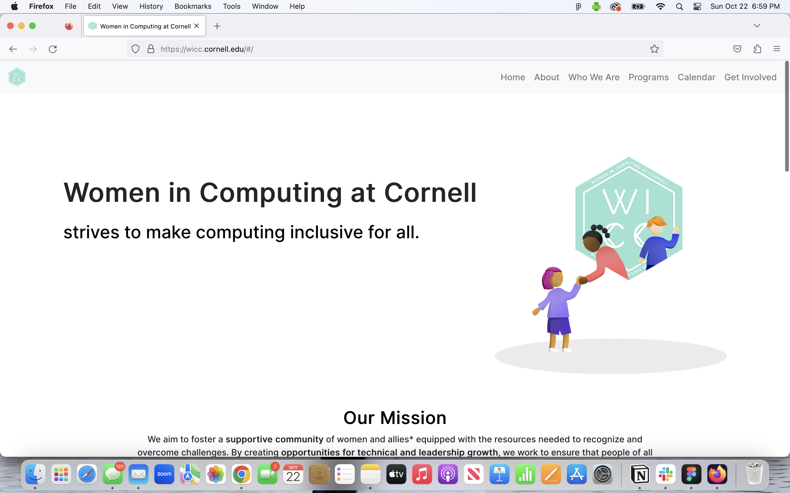
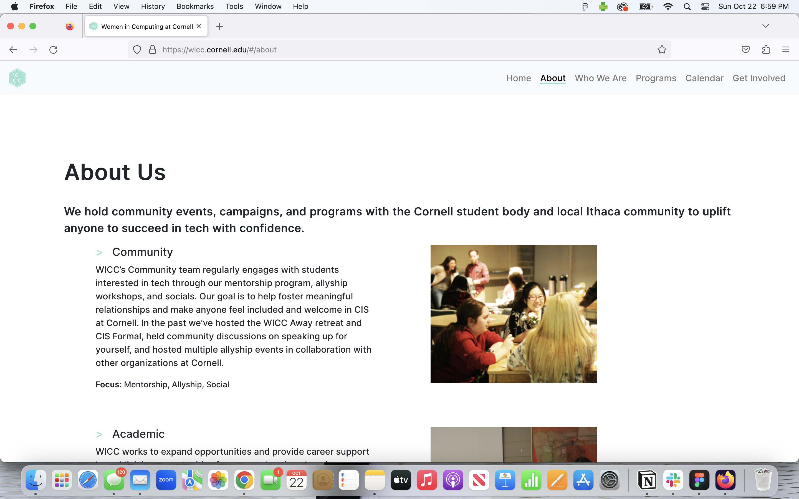
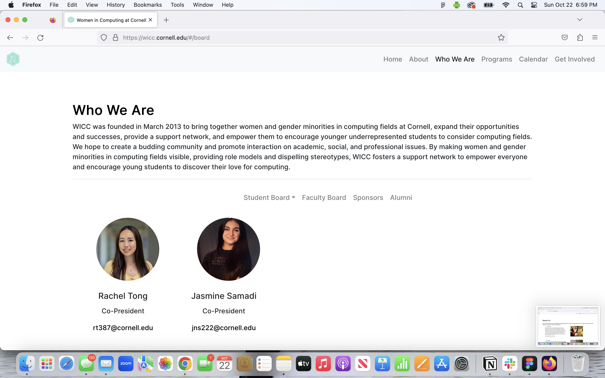
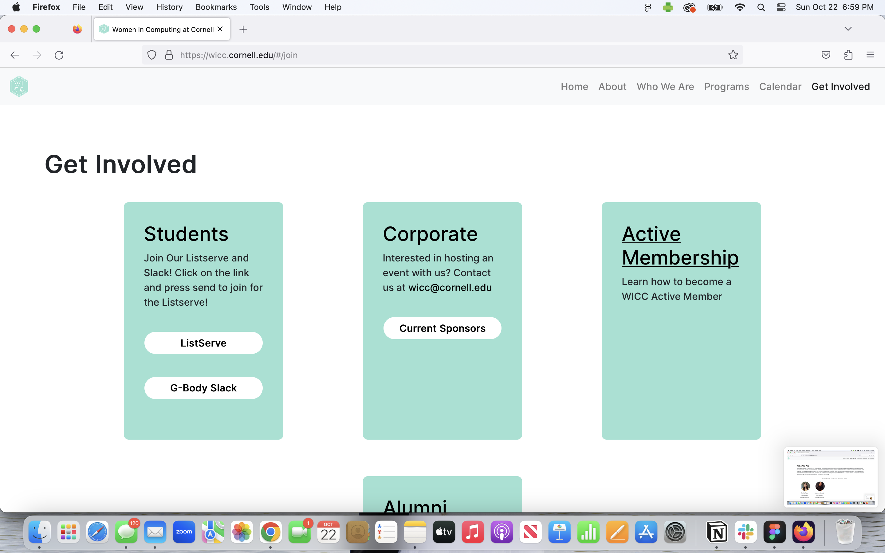

How we plan on redesigning WICC's site significantly meets the project's requirements because we intend on adding new content (such as more event pictures) and organizing all the content in a clearer way in order to better convey WICC's mission so that visitors can quickly gain a clear picture of what WICC is upon visiting the website. We also want to make each webpage more responsive (especially on narrow screens) in order to improve accessibility for all users. Their current website isn't adapted to a narrow and mobile view; the text becomes unreadable and the photos shrink to be much too small. We will be adding significant interactivity since their current site only seems to have interactivity in a single dropdown menu and some buttons.


### Client Goals (Milestone 1)
> Identify your client's goals for the website.
> What kind of website do they want? What are their goals for the site?
> There is no required number of goals. You need as many goals as necessary to reflect your client's desires.

- Show prospective members how to join / get involved
- Give general information about what the club is and what they do
- Showcase events and G-bodies clearly

### Client Website Scope (Milestone 1)
> We want your project to be successful! It needs to be ambitious, but not too large.
> A good rule-of-thumb is that you should have about 1 content-full page for each team member.
> Explain why the website you will create for your client isn't too small and isn't too big.
> Explain why you think it's the right size for this project.

After digging into WICC's website, as well as the websites of its competitors (ie. SWE, URMC, ACSU), we noticed that these websites all generally have about 5-6 pages, including a homepage, about us, events, e-board, and get involved. And since our group has 5 members, each member would be able to have about 1 content-full page. Additionally, the features our client wants us to incoparate (ie. more images, better organization) is within our skill set.


## Plan/Schedule (Milestone 1)
> Make a plan of when you will complete all parts of this assignment.
> This plan is for your team. There is no required format. Format it so that it works for you!
> Your plan should include when you will interview users and analyze their goals.
> Your plan should also include how and when you will assemble/create the sit's content.
> **Tip:** Your team should plan to work ahead. This project really isn't feasible to complete the night before a deadline.

Conduct user interviews (everyone add one question to the user interview questionnaire): due before lab session Friday, Oct. 27th
Design website: during lab session Friday, Oct. 27th
Go over design with client: weekend of Oct. 28th/29th
Work on HTML pages: week of Oct. 30th
User testing: upon completion of website


## Understanding Users (Milestone 2)

**Make the case for your decisions using concepts from class, as well as other design principles, theories, examples, and cases from outside of class.**

You can use bullet points and lists, or full paragraphs, or a combo, whichever is appropriate. The writing should be solid draft quality, but it doesn't have to be fancy.


### User Interview Questions (Milestone 2)
> Plan the user interview which you'll use to identify the goals of your site's audience.
> You may use the interview template below and revise it as much as you desire.

**User Interview Briefing & Consent:** "Hi, I am a student at Cornell University. I'm currently taking a class on web design and for a project, I am designing the website for WICC. I'm trying to learn more about the people that might use this site. May I ask you a few questions? It will take about 10 minutes. You are free to quit at any time."

1. Please tell me a bit about yourself. You may omit any personal or private information.

2. Have you heard of WICC? If so, what do you know about it?

3. Have you ever visited the WICC website? If so, how was your experience? Did you find everything you were looking for?

4. Are you a part of any student orgs? How did you learn about it? And how did you get involved?

5. Did you visit any student orgs' websites? What were you looking for / what information did you need?

6. Recall a recent club event you attended, what information did you seek? How did you find out about it?

7. What haven't I asked you today that you think would be valuable for me to know?

**After the interview:** "This was really helpful. Thank you so much for agreeing to speak with me today. Have a great day!"


### Interview Notes (Milestone 2)
> Interview at least 1 person for every member of your team from your audience.
> Take notes and include those notes here. Make sure to include a brief description of each interviewee.
> **Copy the interview questions above into each interviewee section below.**
> Take notes for each participant **inline** with the questions.

**Interviewee 1:**

Gina is a freshman CS major in the College of Engineering.

1. Please tell me a bit about yourself. You may omit any personal or private information.
    My name is Gina, I'm doing CS maybe and I'm from New York City.
2. Have you heard of WICC? If so, what do you know about it?
    Yeah, I found out through Hannah (a friend), and it's women in computing, attended a few events for it
3. Have you ever visited the WICC website? If so, how was your experience? Did you find everything you were looking for?
    Nope
4. Are you a part of any student orgs? How did you learn about it? And how did you get involved?
    No other student orgs
5. Did you visit any student orgs' websites? What were you looking for / what information did you need?
    Project team websites, basic information about the teams, responsibilities, what they do
6. Recall a recent club event you attended, what information did you seek? How did you find out about it?
    Pumpkin painting with WICC, event purely for entertainment purposes, Hannah told her about the event
7. What haven't I asked you today that you think would be valuable for me to know?
    Nothing

**Interviewee 2:**

Yinglin is a sophomore Statistical Science and Information Science double major in the College of Arts & Sciences.

1. Please tell me a bit about yourself. You may omit any personal or private information.
   I'm Yinglin, I'm a sophmore and majoing in statistical science and information science.
2. Have you heard of WICC? If so, what do you know about it?
   I heard about WICC spring semester of freshman year. I missed them at clubfest but found their Instagram account which had a link to their website.
3. Have you ever visited the WICC website? If so, how was your experience? Did you find everything you were looking for?
   I found everything that I was looking for. Overall my experience was pretty good, but I noticed that the formatting is off when viewing the website on a narrow screen.
4. Are you a part of any student orgs? How did you learn about it? And how did you get involved?
   I am an active member of Class Councils and Artistic Beads. I Learned about them through club fest.
5. Did you visit any student orgs' websites? What were you looking for / what information did you need?
   For the organisations that I am in, there is no website. The Brain Initiative Alliace website has a basic design and the visuals aren't great.
6. Recall a recent club event you attended, what information did you seek? How did you find out about it?
   I usually find out about events through Slack and through word-of-mouth. I don't use websites often beacuse they're usually not up to date and not the most convenient way of finding out about events. Social media is more convenient. I recently attended a brunch event for WICC. There was a lot of miscommunication between the organizers and the particpants. The organizers were supposed to let participants know which professor was going to be at the brunch so that participants could spend some time researching the professor beforehand.
7. What haven't I asked you today that you think would be valuable for me to know?
   On the WICC website, it would be good if there was a short description of the event in the events calendar, as was as information regarding the point of contact and how to sign up for the event. I found myself having to email the organizers for clarification/more details about events.

**Interviewee 3:**

Jane is a sophomore majoring in CS

1. Please tell me a bit about yourself. You may omit any personal or private information.
A sophomore CS student in the college of arts and sciences (taken CS 1110, 2110, 2800, and in 3110 right now).

2. Have you heard of WICC? If so, what do you know about it?
Yes, she has heard of WICC - she is actually a volunteer at Girls Who Code classes on Sundays in Mann Library (through WICC Outreach).Teaches roughly 20 local elementary to high school-aged kids how to code. She knows that WICC basically provides a supportive community for women pursuing computing-related majors at Cornell in a number of different ways (mentorships, lunch bunches, study sessions, career development, etc.)

3. Have you ever visited the WICC website? If so, how was your experience? Did you find everything you were looking for?
She has visited the website - thinks it's not super intuitive to navigate...specifically the calendar of events wasn’t working well for her when she tried to view it.

4. Are you a part of any student orgs? How did you learn about it? And how did you get involved?
She's part of the Milstein Program in Technology & Humanity (like a CS and humanities program in A&S) and the women's club basketball team. She learned about the former when she applied to Cornell - all A&S applicants are invited to apply. Since that was the first time she'd heard of the program, the design of the website was a big reason she decided to apply. The goal of the program was succinctly stated, the opportunities it provided were clear, and it was up to date (as well as highlighting fun events and listing information about current scholars). Overall very professional-looking. For basketball,  she knew she wanted to join the club basketball team, so she tracked it down at clubfest and went to tryouts.

5. Did you visit any student orgs' websites? What were you looking for / what information did you need?
Sort of answered this above - feels like having information about current members, events, etc. is helpful, as well as a short "mission statement" and an events calendar/opportunities ahead.

6. Recall a recent club event you attended, what information did you seek? How did you find out about it?
She went to a social for WICC volunteers and heard about that through the team Slack...that had the date/time and plans for activities. For club basketball there's a Google Calendar, but word of mouth at practice is usually how she hear about stuff for that. Milstein events are advertised through a GroupMe and/or email.

7. What haven't I asked you today that you think would be valuable for me to know?
None

**Interviewee 4:**

Natalie is a freshman majoring in CS in CoE

1. Please tell me a bit about yourself. You may omit any personal or private information.
She is a freshman majoring in CS in the College of Engineering, and currently taking CS 2110.

2. Have you heard of WICC? If so, what do you know about it?
Yes, it is an organization at Cornell to help women in computing.

3. Have you ever visited the WICC website? If so, how was your experience? Did you find everything you were looking for?
Yes, the website was really buggy and it sucked, there were pages that were not found when clicking on links and did not find everything she was looking for.

4. Are you a part of any student orgs? How did you learn about it? And how did you get involved?
She is a part of the women's fencing team at Cornell. She learned about it when she was being recruited while doing fencing competitively. Also she is a part of Hong Kong Student Association, which she searched up on Instagram and went to their Hibachi night after seeing the Instagram post.

5. Did you visit any student orgs' websites? What were you looking for / what information did you need?
Yes, she visited HKSA, SWE, WICC, and ACSU's websites. Natalie was looking for meeting times and also just looking for fun.

6. Recall a recent club event you attended, what information did you seek? How did you find out about it?
She attended the URMC Duolingo intern QnA event, and needed info on where it was, what time, and general information about the topic. She found the information she needed on Instagram.

7. What haven't I asked you today that you think would be valuable for me to know?
None

**Interviewee 5:**

Olivia is a sophomore majoring in CS in the CoE.

1. Please tell me a bit about yourself. You may omit any personal or private information.
   She is a student studying CS; she is currently taking CS 2800 and CS 3110. She plays water polo and video games.

2. Have you heard of WICC? If so, what do you know about it?
    Yes, she reads WICC newsletters and sometimes attend events. They hold workshops and lunch bunches.

3. Have you ever visited the WICC website? If so, how was your experience? Did you find everything you were looking for?
   No, she has never visted the WICC website.

4. Are you a part of any student orgs? How did you learn about it? And how did you get involved?
   She is in CSA. She went to a few of their events, and she liked her big, so she joined.

5. Did you visit any student orgs' websites? What were you looking for / what information did you need?
   She did not visit the websites of any student orgs.

6. Recall a recent club event you attended, what information did you seek? How did you find out about it?
   She went to a Roblox internship event hosted by ACSU. She learned about it through their newsletter.

7. What haven't I asked you today that you think would be valuable for me to know?
   None.


### Goals (Milestone 2)
> Analyze your audience's goals from your notes above.
> List each goal below. There is no specific number of goals required for this, but you need enough to do the job (Hint: It's more than 1 and probably more than 2).

Goal 1: Learn more about club (ie. mission statement) and current members

- **Design Ideas and Choices** _How will you meet those goals in your design?_
  - We will include a concise description of WICC's mission statement. We will include a photo and a brief bio description for members.
- **Rationale & Additional Notes** _Justify your decisions; additional notes._
  - By including a description of the mission statement, visitors will know what the club is about and what their purpose is, gaining better insight into whether they want to join. Photos and descriptions of WICC members will help visitors learn more about current members and see if they know anyone in the club already.

Goal 2: Discover upcoming events and how to participate

- **Design Ideas and Choices** _How will you meet those goals in your design?_
  - Include links to their social media and an events section/page for upcoming events.
- **Rationale & Additional Notes** _Justify your decisions; additional notes._
  - By clearly indicating upcoming events, visitors are able to quickly learn about events, location/time information, and how to participate (ie. RSVP).

Goal 3: Learn about how to become an active member or apply for e-board

- **Design Ideas and Choices** _How will you meet those goals in your design?_
  - Include a page about clear requirements to become an active member and how to run for e-board.
- **Rationale & Additional Notes** _Justify your decisions; additional notes._
  - This will help prospective members easily learn about how to get involved and prepare them for the event/time requirements/commitments.


### Audience (Milestone 2)
> Briefly explain your site's audience.
> Be specific and justify why this audience is a **cohesive** group with regard to your website.

Our audience is women (students) at Cornell who are interested in/pursuing a computer science-related field. These can be students in a CS major, an engineering major, or just a student who likes coding and wants to get more involved in computing events. This audience is cohesive in regards to our goals because only active Cornell students have the ability to apply to the organization. Additionally, only students who have an interest in coding would be looking to find information about coding events they can attend and how they would be able to get involved. The club is exclusively for women, which is my our audience is only women. These students would also be interested in learning about friends or leaders in the club, which relates to the goal of viewing active members.


## Website Design Exploration (Milestone 2)

Identify three websites (preferably static websites) that exist today on the web to draw inspiration from. Please select websites that are similar to the website you wish to create.

Include two screenshots of the home page for each site: narrow and wide.

**We'll refer to these are your "example websites."**

1. <http://women.rit.edu/>

    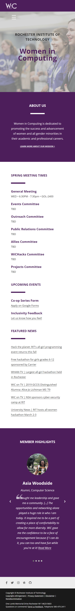

    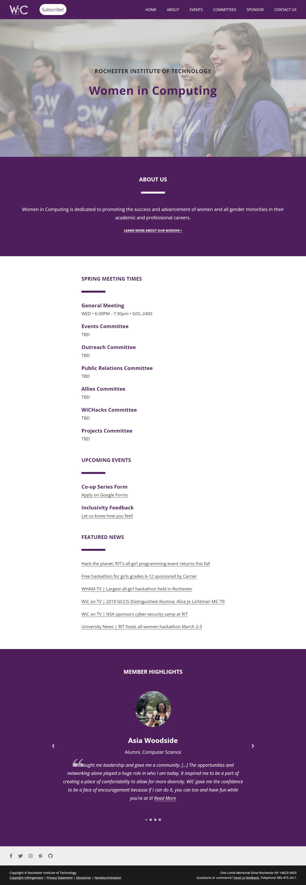

2. <https://cornell.campusgroups.com/arci/home/>

    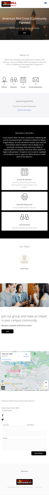

    

3. <https://tclifelong.org/social-groups/>

    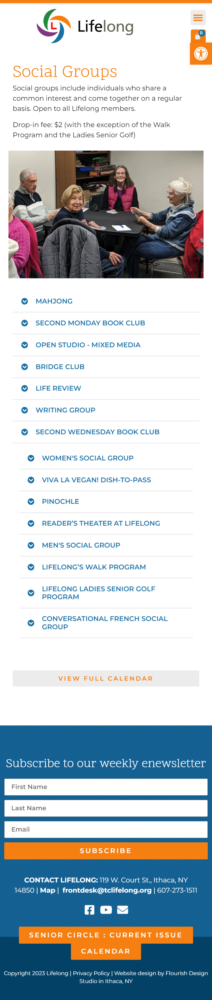

    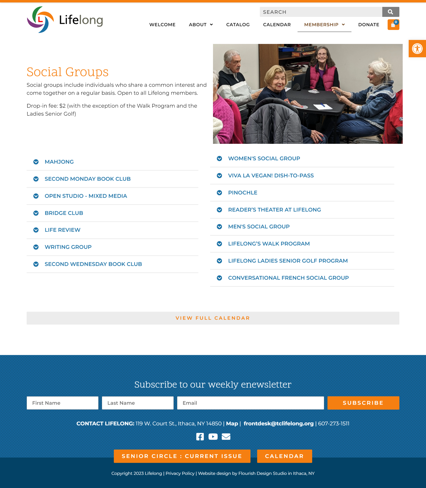


### Example Website 1 Review (Milestone 2)
> Review the website you identified above. (1 paragraph)
> In your review, include a discussion common design patterns and interactivity in the site.

This website is about women in computing at the Rochester Institute of Technology. It provides a variety of content related to information about the organization, how to join/support, upcoming events, and information about its members. This website does a decent job about presenting this content to the user and also employs some common design patterns and interactivity to assist in doing so. These include a purple/white theme, navigation bar, header/footer, forms, hamburger menu, vertically stacking information in the narrow view, and carousel. However, some of these features are not executed as well as they could be. For example, when the hamburger menu is clicked on in the narrow view it moves to the side of the screen which looks unpleasent. Also, some of the content becomes hard to read as the positioning is not properly dealt with when the screen changes sizes.


### Example Website 2 Review (Milestone 2)
> Review the website you identified above. (1 paragraph)
> In your review, include a discussion common design patterns and interactivity in the site.
>

This website is about the American Red Cross Community at Cornell. It provides a variety of content related to information about the organization, how to join/support, upcoming events, and information about leadership. This website does a decent job about presenting this content to the user and also employs some common design patterns and interactivity to assist in doing so. It has a fairly simplistic black/white/red theme and organizes content in a visually pleasing manner. Some common design patterns used in the website are a navigation menu, header/footer, home photo, logo and vertically stacking content in the narrow view. Some methods of interactivity used are hamburger menus, forms, and a live map. This website is overall functional and usable but could use some improvements in its visual appeal.


### Example Website 3 Review (Milestone 2)
> Review the website you identified above. (1 paragraph)
> In your review, include a discussion common design patterns and interactivity in the site.

This website is about an organization called LifeLong, that provides a social group for elderly people. It provides a variety of content related to information about the organization, how to join/support, upcoming events, what they do, and how their memberships work. This website does a decent job about presenting this content to the user and also employs some common design patterns and interactivity to assist in doing so. It uses common patterns such as a navigation bar, header/footer, logo, home-screen photo, side-bar, and a consistent theme (white/orange). Additionally this website uses a variety of interactive features such as a hamburger menu, search bar, drop-down menu, form, and an accordion. Even though this website is well put together and professional, it uses so many interactive features that it may be confusing to use for members of their audience (older people).


## Content Planning (Milestone 2)

Plan your site's content.

### Your Site's Planned Content (Milestone 2)
> List **all** the content you plan to include your website.
> You should list all types of content you planned to include (i.e. text, photos, images, etc.)
> Briefly summarize the content; do not include the content here.

- Mission statement / about us / summary of club
- Members (ie. images and descriptions)
- Photos from past events / programs
- List of upcoming events
- Links to social media (ie. Listserv, Slack, Instagram)
- How to get involved (ie. become active member, apply for e-board, program descriptions)
- List of sponsors (images, etc.)


### Content Justification (Milestone 2)
> Explain (about a paragraph) why this content is the right content for your site's audience and how the content addresses their goals.

This content is appropriate for our site's audience because visitors come to this website with the goal of learning more about WICC, its events, and how to get involved. The mission statement / about us section as well as images and descriptions of current members provide an overview of WICC and allows users to learn what this club is actually about. A clear list of upcoming events as well as links to social media pages provide users with the event description, time and location information so that they can decide if they want to go. Finally, the current website has a section about how to get involved, but the information is hidden and difficult to find. Thus, having a specific page about how to get involved and clear instructions about requirements for becoming an active member, applying for e-boards, etc. is important of female students in CS and those interested in CS to determine if they would like to join WICC.


## Information Architecture (Milestone 2)

### Content Organization (Milestone 2)
> Document your **iterations** of card sorting here. You must have at least 2 iterations of card sorting.
> Include photographic evidence of each iteration of card sorting **and** description of your thought process for each iteration.
> Please physically sort cards; please don't try and do this digitally.

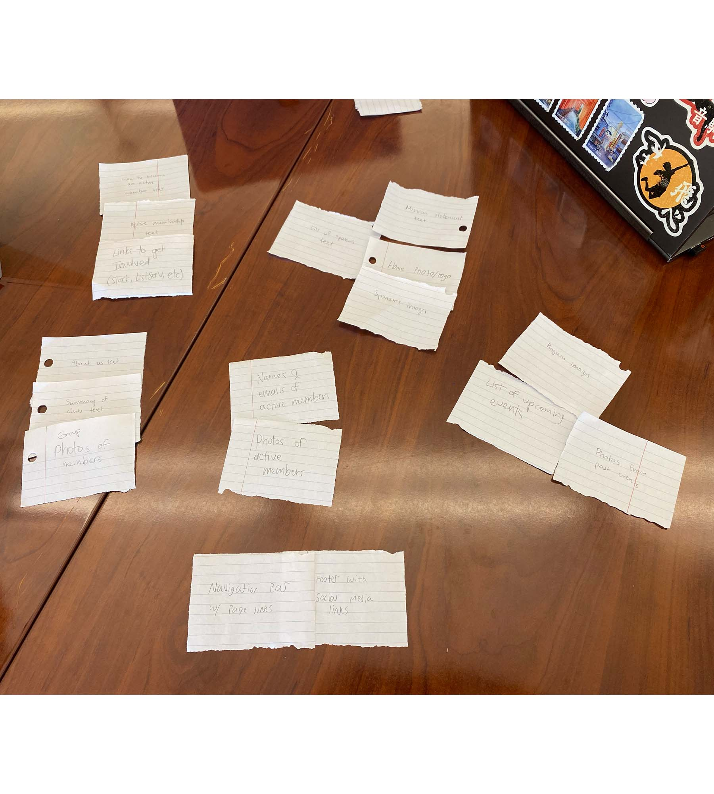
We decided to divide our content into 5 groups. One group was dedicated to a Home page, with quick information about WICC such as the mission statements and the sponsors for the organization. We then decided to group information about active members into one category with their photos and info. We grouped information about events such as a list of upcoming events and photos to represent those events. We grouped information that would be considered "About Us" through the summary and details about the club and group photos. Finally we made a group with how to get involved with links to social media and email lists, and application and eboard information. (Nav bar and footer are included in every page)

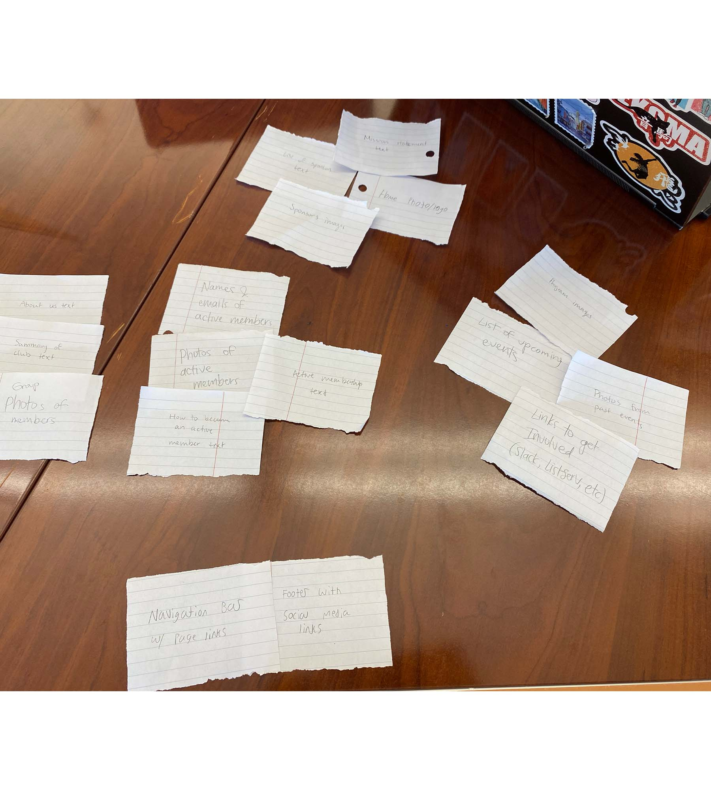
In this sorting, we had similar grouping for an "About" page and a page for Home or quick information, but we combined elements of the other three pages from our previous sorting. We grouped the active members list with information about how to become an active member and what it means to be an active member (the different roles). We also created a group that shows events and programs, and included the links for non-eboard members to get information about the upcoming events.

### Final Content Organization (Milestone 2)
> Which iteration of card sorting will you use for your website?

We are planning to use our first iteration of card sorting.

> Explain how the final organization of content is appropriate for your site's audiences.

This organization includes the multiple goals of our audience. One goal of the audience is to discover the events women interested in computing can attend. This is satisfied through our page that lists events and shows images of these events. Additionally, our audience may be looking to learn what WICC is to decide if they want to get involved. This is satisfied through and About page where we include the summary of the club and its goals, as well as photos to demonstrate what the membership looks like. Our audience may also be interested in taking their interest further to apply to the organization or join information lists, so our page with links to get involved and information to apply to a position is grouped together. Our audience of cornell women interested in computing may want to know who is already involved that they can contact to learn more, or see familiar faces. For this reason we added a page to show active members and those in leadership (with images). Finally, we grouped quick information such as the mission statement and photos of the group to be a Home page to establish a sense of community and purpose for the club upon initially entry to the site.


### Navigation (Milestone 2)
> Please list the pages you will include in your website's navigation.

- Home
- About
- Current Members
- Events & Programs
- How to Join

> Explain why the names of these pages make sense for your site's audience.

"Home" is a clear name for the homepage, providing overall information about WICC to visitors so that they can have a brief overview of WICC. "About" is an appropriate name for visitors that want to gain more information about WICC, especially its a summary of WICC and group phots. "Current Members" clearly describes where visitors can look to learn more about current WICC members. For visitors that are just interested in going to events, they can easily find the information on the "Events & Programs" page. Finally, for CS girls who are interested in being involved in WICC, they can find requirements and more information in the "How to Join" page.


## Visual Theme (Milestone 2)
> Discuss several (more than two) ideas about styling your site's theme. Explain why the theme ideas are appropriate for your target audiences. Note the theme you selected for your site and why it's appropriate for the audience and their goals.

One theme idea is to make the website with rounded edges and buttons, a rounded font, and light colors. This would make the site seem inviting and lighthearted, representing the sense of community and inclusivity of WICC. Based on our client responses and the current WICC mission and audience of all women at Cornell interested in computing, the audience will feel welcome to join WICC if the website seems less stern and serious through the rounded elements. The website can be white and aqua, using aqua for contrast and emphasis (buttons, divi ding a section). Text can be a darker gray. Another option is to make the website pointed and formal. This may include sharp boxes for buttons and borders, neutral colors, and imagery of members working and collaborating in a professional setting. This would convey a sense of professionalism for the club and may appeal to women interested in computing at Cornell who are looking to build skills and get jobs. This can be a website with a black or dark gray background, white and aqua text, and a simple font. We could also go a more "fun" route with multiple bright colors (possibly the entire background of the site being aqua), and blocky or brush stroke text. However though this may make the organization seem fun, it could take away from the intention of learning and formal structure of the org.

For our site, we will go with a more simple and inviting style because our intended audience is women interested in computing at Cornell, rather than other formal and competitive clubs. WICC's events are open to all levels of coding, and are meant to encourage women to learn and meet other women with similar interests. They aim to be supportive and while their name includes "Women", they emphasize that all gender identities are welcome. The site including simple and rounded text will show this message, and we will include imagery of events from the organization where members are smiling and sharing a love of learning. We want our audience to be able to easy access events and links, so our buttons will be a contrasting aqua color to the white background, and the text will be dark and readable.


## Design (Milestone 2)

Document your site's layout.

## Interactivity Brainstorm (Milestone 2)
> Using the audience goals you identified, brainstorm possible options for interactivity to enhance the functionality of the site while also assisting the audience with their goals.
> Briefly explain idea each idea and provide a brief rationale for how the interactivity enhances the site's functionality for the audience.
> Note: You may find it easier to sketch for brainstorming. That's fine too. Do whatever you need to do to explore your ideas.

- The first idea is a hamburger menu. Because visitors of this website will be students, we need to anticipate that they may be using the website on their phone, iPad, laptop, etc. Because the browser sizes are going to be different, the website should have the appropriate navigation menu. A hamburger menu is helpful to clearly see all of the navigation options on a narrow screen, and it also saves vertical space (and prevents the need to excessively scroll) since the user can just click the icon when they need to switch pages.
- The second idea is creating a carousel. Because there are a lot of pictures for the events and programs page, a carousel would be an effective way to display the pictures while making the user interact and engage with the website. This way of displaying pictures allows the audience to see what events and programs at WICC look like.
- The third idea is to create an accordian. In the event and programs page, there are many events and programs listed along with long descriptions of each. These long descriptions bury out the other programs' titles making it harder for users to find a specific event/program.So, implementing an accordian that can collapse all of the descriptions until the user clicks on a title for more information can better help the user find the information they've been looking for.


### Layout Exploration (Milestone 2)
> Iterate on your site's design through sketching.
> Sketch both the narrow and wide versions of the site.
> Here you are just exploring your layout ideas. You don't need to sketch every page.
> Include some of your interactivity ideas in your sketches.
> Provide an explanation for each sketch explaining the idea and the design patterns you are leveraging.

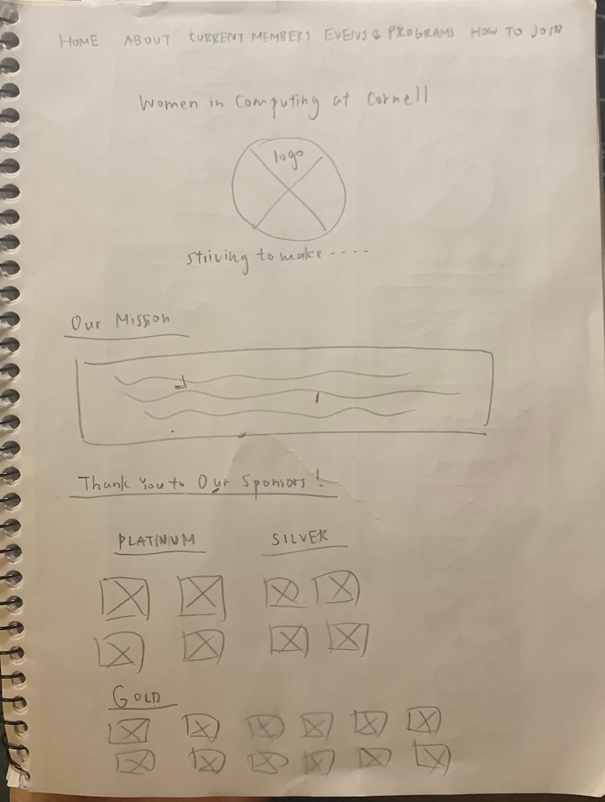
This is a sketch of one possible layout for the homepage on wide screens. The navigation is formatted as a horizontal navigation bar to make use of the available space. The order in which content is placed indicates a clear hierarchy of information. The name of the organization, logo and mission statement is centered at the top of the page to serve as an introduction to the organization. The next section goes into more detail about the mission of WICC, which the audience can read if they are interested in learning more about WICC. The organization's sponsors are placed at the bottom as they are likely not as important to the website's audience.

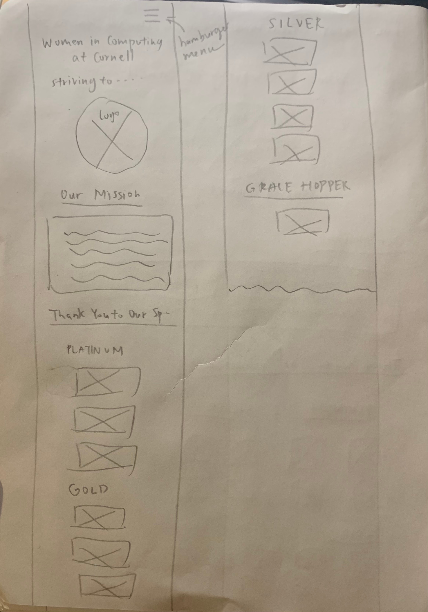
This is a sketch of a possible layout for the homepage on narrow screens. The order in which content is placed also indicates a hierarchy of information, but due to the limited space on narrow screens the content is stacked vertically. Also, a hamburger menu is implemented to hide and condense the navigation menu on narrow screens, saving screen space and providing a cleaner and more focused view of the main content.

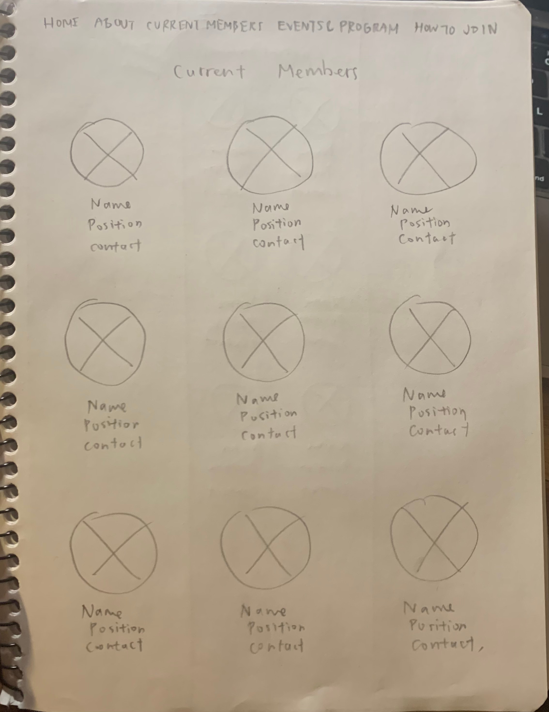
This is a sketch of a possible layout for the Current Members page on wide screens. The navigation is formatted as a horizontal navigation bar to make use of the available space. To ensure uniformity, every member is featured with a photograph, their name, organizational position and contact details placed beneath the image. To achieve a visually pleasing layout, each member's photo and information are distributed across evenly spaced rows and columns.

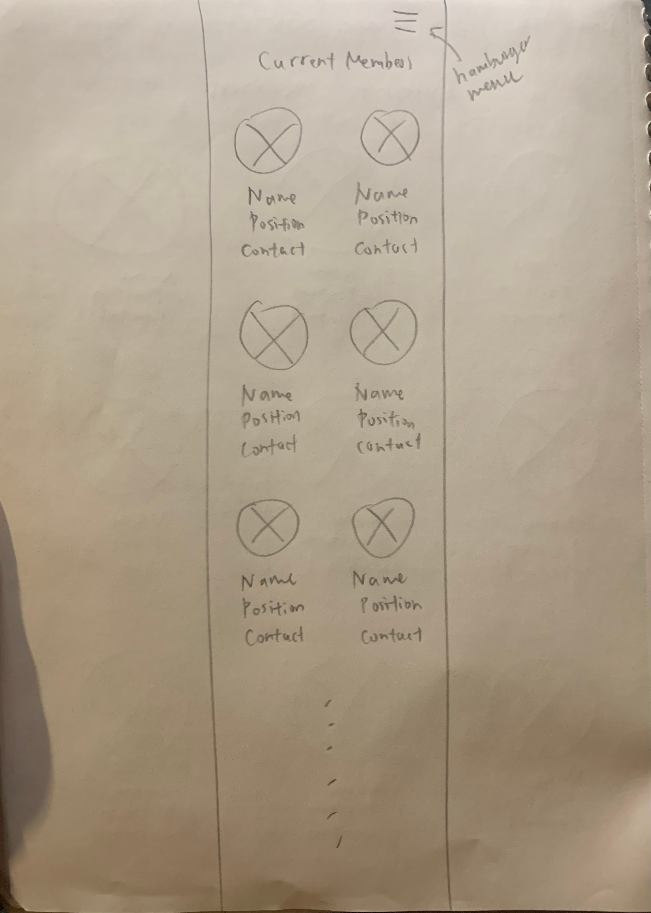
This is a sketch of a possible layout for the Current Members page on narrow screens. A hamburger menu is implemented to hide and condense the navigation menu on narrow screens, saving screen space and providing a cleaner and more focused view of the main content. Due to the limited space on narrow screens, each member's photo and information are distributed across evenly spaced rows and columns, but fewer columns and more rows than on wide screens.

> Include the final sketches for each of your pages.
> **Include your final interactivity in your sketches.** Include annotations to explain what happens when the user takes an action with your interactivity.
> The sketches must include enough detail that another 1300 student could implement them.
> Please provide an explanation for each sketch.

**Narrow Design:**


This is a sketch of the homepage on narrow screens. On the top, there is a hamburger menu, designed to adhere to familiar/common website designs. When clicking on the icon, the vertical menu appears. This method saves space so that users don't have to scroll past a long menu for each page. The logo and club name is at the  top to serve as an introduction. The mission statement is located in a box underneath because it includes important information about the club's purpose, helping female CS students determine whether this club is the right fit. The sponsors are arranged at the bottom of the page in an organized way.

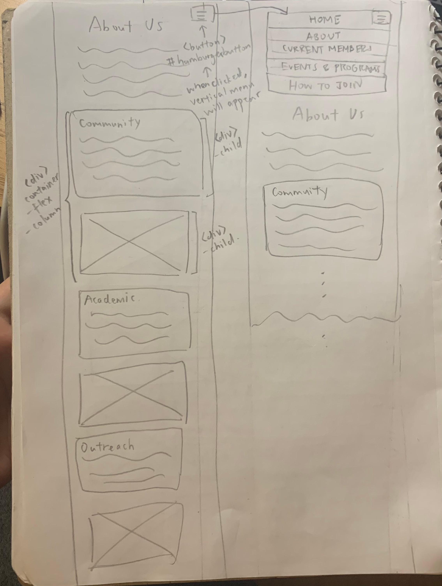
This is a sketch of the About page on narrow screens. At the top there is a hamburger menu, designed to adhere to familiar website designs. When the user clicks on the icon, the navigation menu appears. The text content is organize into distinct sections, enhancing user accessibility.

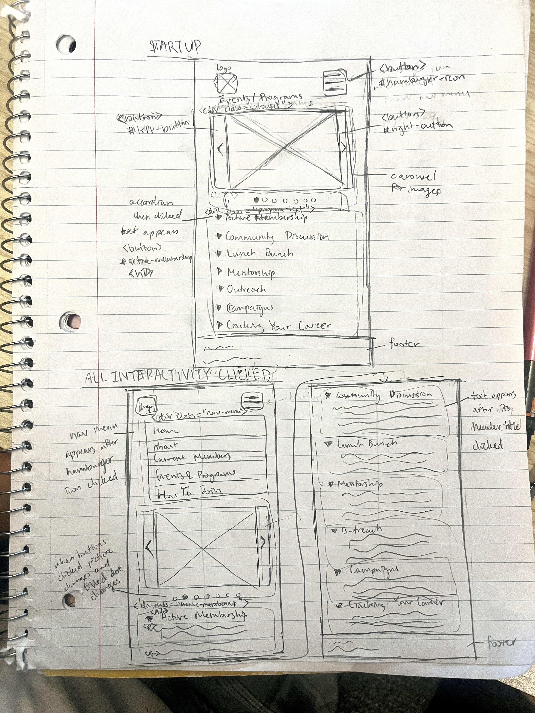
In this sketch, a hamburger menu is implemented to conserve space. When clicked, the navigation menu drops down. The content is stacked on top of each other, with the image carousel on top of the accordian text taking up the full width of the screen.

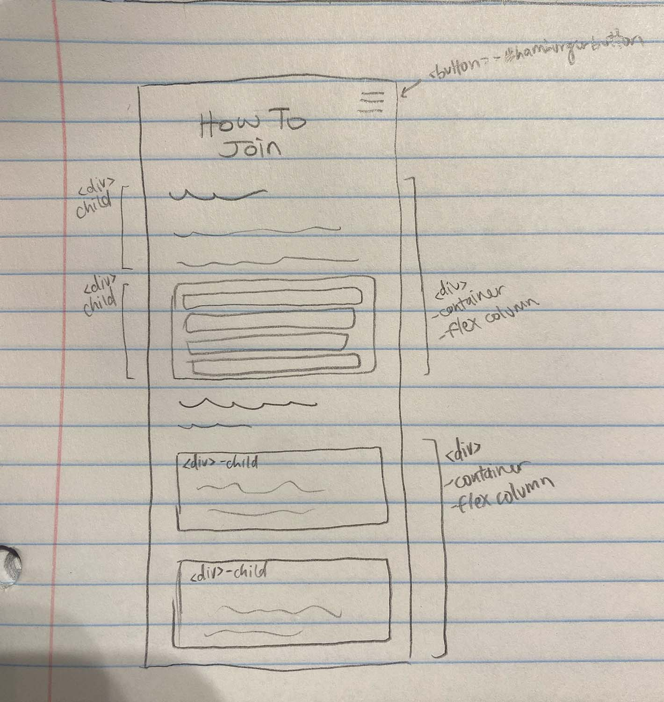
In this narrow design, the alignment of text to the left remains the same to keep cohesiveness. Contrary to the wide version of this page, the content is all stacked vertically. The text to explain how non-active members can get involved is immediately followed by a section of links for them to take action on the information. Similarly, a brief description of active membership is then followed by sub-sections to explain the main points and benefits of active membership. All of these sections are spaced out and easy to differentiate between.


In this design, the members of WICC are displayed in an organized manner where members are displayed in rows of 2 (reduced from rows of 4 in wide display). Each member has their name, position, and email (which is a link to a mailing software with an comopsed email with the email already filled in) under their picture. Lastly, the navigation menu switches to a hamburger menu in the narrow display which becomes visible at the top of the page when clicked. This design offers a simple and organized display of the members of WICC that is easily accessible for the audience.

**Wide Design:**


This is a sketch of the homepage on wide screens. On the top, there is a horizontal navigation menu that is visible and easy to use on wide screens. The logo and club name is at the very top to serve as an introduction. Flexboxes are used to put them side-to-side. The mission statement is located in a box underneath because it includes important information about the club's purpose, again helping female CS students determine whether this club is the right fit. Using flexboxes, the sponsors are arranged at the bottom of the page in a way that saves space and gives an organized appearance.

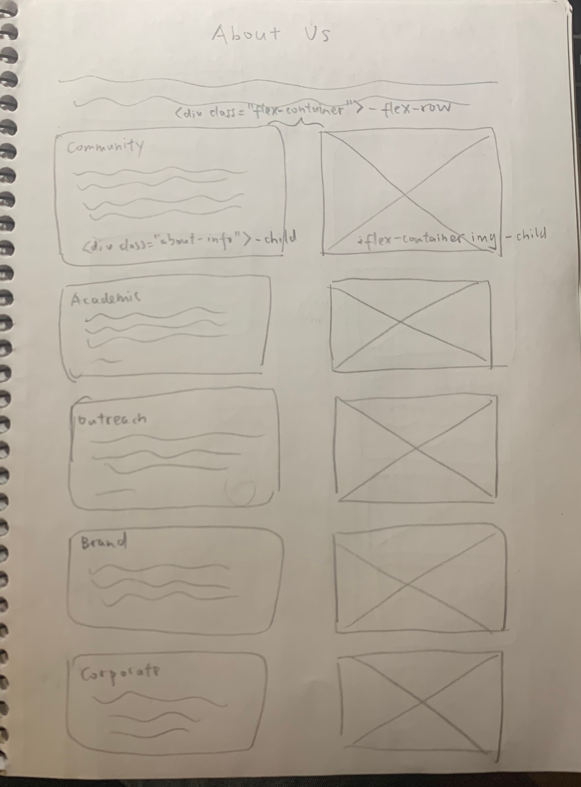
This is a sketch of the About page on wide screens. At the top, there is a horizontal navigation bar that is easy to use on wide screens. The text content is organize into distinct sections, enhancing user accessibility. Flexboxes are used to put each section and an image side by side in order to make use of the available space.


This design, contrary to the narrow version, has no hamburger menu and instead there is a nav bar at the top. The accordian text is located on the left side of the string, and the image carousel is on the right. The content is arranged in a row style.


This page has multiple flex rows in order to organize main topics with their subcontent. The "Stay Up To Date" section is accompanied by a list of links directly to its right so show the association to the links. Below this, there will be a main heading and text to explain how to be an active member, then the sub-content will be displayed in a row to show that they are equal in hierarchy and fall under the umbrella of becoming an active member.


In this design, the members of WICC are displayed in an organized manner where members are displayed in rows of 4. Each member has their name, position, and email (which is a link to a mailing software with an comopsed email with the email already filled in) under their picture. There is no interactivity on this page as it offers a simplistic but organized display of the members of WICC that is easily accessible for the audience.


### Design Rationale (Milestone 2)
> Explain why your design is appropriate for your audience.
> Specifically, why does your content organization, navigation, and site design/layout meet the goals of your users?
> How did you employ **design patterns** to improve the familiarity of the site for your audience?

For each webpage, a navigation menu or hamburger menu, depending on the browser size, is found on the top to improve the familiarity of the site for my audience since this is the usual convention for website, so that they can easily navigate between pages to discover the information they need. The homepage is designed to give an overview of WICC, so it displays the WICC logo at the top and provides the mission statment below so that students can determine whether they're interested in this club and want to learn more. To learn more about the club, the content is structured so that there is an About page and Current Members page to indicate to users where they can get a deeper knowledge of WICC. Images of the group and individual members are included on these pages to help with visualization and create a welcoming, friendly website. Emails of some members are included as ways for student visitors to ask questions about WICC. For users who's goals is to get involved immediately, pages are intentionally titled "Events & Programs" and "How to Join" and they list the upcoming events and requirements for becoming an active member, for example. Bullet points are used to enhance familiarity and reduce ambiguities about what female CS students should expect when getting involved. Overall, throughout the website, teal boxes/background color are used to increase visibility and emphasize important information, such as important links or the mission statement. And because footers are commonly used on websites, it is included on this website as a way of navigating to WICC's social media pages.


## Interactivity Rationale (Milestone 2)
> Describe the purpose of your proposed interactivity.
> Provide a brief rationale explaining how your proposed interactivity addresses the goals of your site's audience and enhances their user experience.

The goal of the female CS students when visiting this site is to learn more about WICC and its purposes, discover upcoming events, and see how they can get involved right away. However,  using the same navigation menu for all browser sizes can inhibit their ability to find information easily and navigate to different pages. As a result, implementing a hamburger menu helps users save time when looking on the website to learn more information and it provides a convenient and familiar way to navigate between pages, helping users find all the information they need to decide whether they would like to join WICC. The program and events page has a lot of information related to each event, but listing it all out would make finding the specific event the audience is looking for hard to do, expecially if the event they're looking for is at the bottom of the page. Implementing an accordian to collapse all text but the title helps the user find the information they want more quickly and reduces clutter because it allows the audience to show only the information necessary to their goal. Lastly, the carousel for program and event images enhances the experience of the audience because they can interact with the photos and scroll through them in an organized manner. There are several photos, and it makes the site cleaner and clearer for the user to display these photos through a carousel rather than make the user scroll through seven photos to reach the information they actually need.


## Interactivity Plan (Milestone 2)
> Now that you've designed your interactivity for your site, you need to plan how you will implement it.
> Describe how you will implement the interactivity. This should be a complete plan that another 1300 student could use to implement the interactivity.
> You should list the HTML elements, CSS classes, events, pseudocode, and the initial state.

To toggle hamburger menu for narrow screens:

```
//When #wideMenu is "clicked" and the #wideMenu is hidden
    //Remove .hidden to #wideMenu
//When #wideMenu is "clicked" and the #wideMenu isn't hidden
    //Add .hidden to #wideMenu
```

To hide hamburger icon and show horizontal navigation when window is resized and too wide:

```
//When "resize" to window and it's too narrow
    //Remove .hidden to #hamburgerButton
    //Add .hidden to #wideMenu
```

To show hamburger icon and hide horizontal navigation when window is resized and too narrow:

```
//when "resize" to window and it is too wide
    //Add .hidden to #hamburgerButton
    //Remove .hidden to #widemenu
```

To show the appropriate menu when a page loads:

```
//Upon each page loading
    //Check if the browser size is narrow
        //Remove .hidden to #hamburgerButton
        //Add .hidden to #wideMenu
    //Check if the browser size is wide
       //Add .hidden to #hamburgerButton
       //Remove .hidden to #widemenu
```

To toggle accordian:

```
When #active-membership-button clicked and #active-membership-text is hidden:
    Remove .hidden to #active-membership-text
When #active-membership-button clicked and #active-membership-text is not hidden:
    Add .hidden to #active-membership-text
When #community-discussion-button clicked and #community-discussion-text is hidden:
    Remove .hidden to #community-discussion-text
When #community-discussion-button clicked and #active-membership-text is not hidden:
    Add .hidden to #community-discussion-text
When #lunch-bunch-button clicked and #lunch-bunch-text is hidden:
    Remove .hidden to #lunch-bunch-text
When #lunch-bunch-button clicked and #lunch-bunch-text is not hidden:
    Add .hidden to #lunch-bunch-text
When #mentorship-button clicked and #mentorship-text is hidden:
    Remove .hidden to #mentorship-text
When #mentorship-button clicked and #mentorship-text is not hidden:
    Add .hidden to #mentorship-text
When #outreach-button clicked and #outreach-text is hidden:
    Remove .hidden to #outreach-text
When #outreach-button clicked and #outreach-text is not hidden:
    Add .hidden to #outreach-text
When #campaigns-button clicked and #campaigns-text is hidden:
    Remove .hidden to #campaigns-text
When #campaigns-button clicked and #campaigns-text is not hidden:
    Add .hidden to #campaigns-text
When #cracking-your-career-button clicked and #cracking-your-career-text is hidden:
    Remove .hidden to #cracking-your-career-text
When #cracking-your-career-button clicked and #cracking-your-career-text is not hidden:
    Add .hidden to #cracking-your-career-text
```

To scroll right on carousel:

```
When #right-button-carousel clicked:
    If #carousel-image-1 not hidden:
        Add .hidden to #carousel-image-1
        Remove .hidden to #carousel-image-2
        Add .hidden to #carousel-indicator-1
        Remove .hidden to #carousel-indicator-2
    If #carousel-image-2 not hidden:
        Add .hidden to #carousel-image-2
        Remove .hidden to #carousel-image-3
        Add .hidden to #carousel-indicator-2
        Remove .hidden to #carousel-indicator-3
    If #carousel-image-3 not hidden:
        Add .hidden to #carousel-image-3
        Remove .hidden to #carousel-image-4
        Add .hidden to #carousel-indicator-3
        Remove .hidden to #carousel-indicator-4
    If #carousel-image-4 not hidden:
        Add .hidden to #carousel-image-4
        Remove .hidden to #carousel-image-5
        Add .hidden to #carousel-indicator-4
        Remove .hidden to #carousel-indicator-5
    If #carousel-image-5 not hidden:
        Add .hidden to #carousel-image-5
        Remove .hidden to #carousel-image-6
        Add .hidden to #carousel-indicator-5
        Remove .hidden to #carousel-indicator-6
    If #carousel-image-6 not hidden:
        Add .hidden to #carousel-image-6
        Remove .hidden to #carousel-image-7
        Add .hidden to #carousel-indicator-6
        Remove .hidden to #carousel-indicator-7
```

To scroll left on carousel:

```
When #left-button-carousel clicked:
    If #carousel-image-2 not hidden:
        Add .hidden to #carousel-image-2
        Remove .hidden to #carousel-image-1
        Add .hidden to #carousel-indicator-2
        Remove .hidden to #carousel-indicator-1
    If #carousel-image-3 not hidden:
        Add .hidden to #carousel-image-3
        Remove .hidden to #carousel-image-2
        Add .hidden to #carousel-indicator-3
        Remove .hidden to #carousel-indicator-2
    If #carousel-image-4 not hidden:
        Add .hidden to #carousel-image-4
        Remove .hidden to #carousel-image-3
        Add .hidden to #carousel-indicator-4
        Remove .hidden to #carousel-indicator-3
    If #carousel-image-5 not hidden:
        Add .hidden to #carousel-image-5
        Remove .hidden to #carousel-image-4
        Add .hidden to #carousel-indicator-5
        Remove .hidden to #carousel-indicator-4
    If #carousel-image-6 not hidden:
        Add .hidden to #carousel-image-6
        Remove .hidden to #carousel-image-5
        Add .hidden to #carousel-indicator-6
        Remove .hidden to #carousel-indicator-5
    If #carousel-image-7 not hidden:
        Add .hidden to #carousel-image-7
        Remove .hidden to #carousel-image-6
        Add .hidden to #carousel-indicator-7
        Remove .hidden to #carousel-indicator-6
```


## Client Feedback & Minutes (Milestone 2)
> You should meet with your client again to obtain feedback on your design.
> Provide a summary of the client's feedback and your meeting's minutes.

We met with the client over Zoom, showed her the wide and narrow designs of all the pages on the website, and asked her to provide feedback. The client expressed overall satisfaction with our design, emphasizing the improved responsiveness to screen width compared to the current design. Specifically, the client praised the How To Join page, highlighting its appeal and functionality. The client liked the consistency in the design maintained across all pages.

## User Testing (Final Submission)

**Conduct user testing with a minimum of 1 participant for every member of your team.**

### User Testing Tasks (Final Submission)
> Plan out your user testing tasks before doing your user testing.
> These must be actual user testing tasks.
> **Tasks are not questions!**

1. Find the mission statement and what the club is about.

2. Find out how to get involved/become an active member.

3. Find the meeting times of one program/event.


### Participant 1 (Final Submission)
> Using your notes from above, describe your user by answering the questions below.

1. Who is your user, e.g., where does the user come from, what is the user's job, characteristics, etc.?

    Ashley is a sophomore studying Information Science and Economics at Cornell University.

2. Does the user belong to your audience of the site?

    > If “No”, what’s your strategy of associating the user test results to your audience’s needs and wants? How can your re-design choices based on the user tests make a better fit for the audience?

    Yes

### Participant 1 -- Testing Notes (Final Submission)
> When conducting user testing, you should take notes during the test.

1. Find the mission statement and what the club is about.
   - she quickly identified the mission statement on the Home page
   - she scanned the navigation bar and recognized that she had to navigate to the About page
2. Find out out how to get involved/become an active member.
   - she recognized that she had to navigate to the How to Join page.
   - she scrolled down the page to the "become an active member" section, and found the link to the ative member guidlines and requirements at the bottom of the page
3. Find the meeting times of one program/event.
   - she navigated to the "Events and Programs" page
   - She clicked on the "Lunch Bunch" header in the accordian and found the meeting times for the event.


### Participant 2 (Final Submission)
> Using your notes from above, describe your user by answering the questions below.

1. Who is your user, e.g., where does the user come from, what is the user's job, characteristics, etc.?

    Tiffany is a sophmore transfer student at Cornell. She is studying human development on the pre-med track as well as a prospective CS student. She is from New Jersey.


2. Does the user belong to your audience of the site?

    > If “No”, what’s your strategy of associating the user test results to your audience’s needs and wants? How can your re-design choices based on the user tests make a better fit for the audience?

    Yes.

### Participant 2 -- Testing Notes (Final Submission)
> When conducting user testing, you should take notes during the test.

1. Find the mission statement and what the club is about.
   - She found the mission statement on the homepage right away.
   - She also navigated to the About page to learn more about what the club is about.
2. Find out out how to get involved/become an active member.
   - She nagivated to the How to Join page and pointed at the Become An Active Member section.
3. Find the meeting times of one program/event.
   - She observed the navigation menu and clicked Events & Programs.
   - She hovered over the accordian sections and clicked Lunch Bunch, where she found the meeting times.


### Participant 3 (Final Submission)
> Using your notes from above, describe your user by answering the questions below.

1. Who is your user, e.g., where does the user come from, what is the user's job, characteristics, etc.?

    Natalie is a freshman studying CS in the college of engineering. She is from Southern California and a recruit on the Cornell fencing team.


2. Does the user belong to your audience of the site?

    > If “No”, what’s your strategy of associating the user test results to your audience’s needs and wants? How can your re-design choices based on the user tests make a better fit for the audience?

    Yes

### Participant 3 -- Testing Notes (Final Submission)
> When conducting user testing, you should take notes during the test.

1. Find the mission statement and what the club is about.
   - She scrolled down and found the mission statement on the homepage.
   - She also navigated to the About page to learn more about what the club is about.
2. Find out out how to get involved/become an active member.
   - She immediately navigated to the How to Join page and found infomration on how to get involved.
3. Find the meeting times of one program/event.
   - She navigated to the Events & Programs page and clicked on the Lunch Bunch accordian thing to find the time of the Lunch Bunch program.


### Participant 4 (Final Submission)
> Using your notes from above, describe your user by answering the questions below.

1. Who is your user, e.g., where does the user come from, what is the user's job, characteristics, etc.?

    Claire is a sophomore in Cornell Engineering. She's from the Bay Area in California and is on the Cornell Racing project team. She is also interested in computer science.


2. Does the user belong to your audience of the site?

    > If “No”, what’s your strategy of associating the user test results to your audience’s needs and wants? How can your re-design choices based on the user tests make a better fit for the audience?

    Yes


### Participant 4 -- Testing Notes (Final Submission)
> When conducting user testing, you should take notes during the test.

1. Find the meeting times of one program/event.
   - she found events and programs tab and clicked
   - looked through list of items in accordian
   - clicked on lunch bunch
   - immediately saw dates and times for meeting
2. Find out out how to get involved/become an active member.
   - she was already on the events and programs page which had an "Active membership" section, so she clicked that section of the accordion
3. Find the mission statement and what the organization is about.
   - she navigated to the "About" page
   - she scrolled through the page and found the many sections about the organization


### Participant 5 (Final Submission)
> Using your notes from above, describe your user by answering the questions below.

1. Who is your user, e.g., where does the user come from, what is the user's job, characteristics, etc.?

    Ashley is a sophomore studying Information Science at Cornell University.


2. Does the user belong to your audience of the site?

    > If “No”, what’s your strategy of associating the user test results to your audience’s needs and wants? How can your re-design choices based on the user tests make a better fit for the audience?

    Yes

### Participant 5 -- Testing Notes (Final Submission)
> When conducting user testing, you should take notes during the test.

1. Find the mission statement and what the club is about.
   - she clicked on the About page to find what the club is about, then navigated to the Home page where she found the mission statement.
2. Find out out how to get involved/become an active member.
   - she navigated to the How To Join page and scrolled down to the "become an active member" section
3. Find the meeting times of one program/event.
   - she navigated to the Events & Programs page, clicked on the Lunch Bunch header of the accordian and identified the meetings times of the Lunch Bunch event.

## Website Revision Based on User Testing (Final Submission)
> What changes did you make to your design based on user testing?

- Added sideways triangles to the accordian on the events & programs page to make it more obvious and familiar to the user that it was an accordian and is clickable to expand.
- Discovered from user testing that the active membership section in the events & programs page was redundant as the same info was already found in the how to join page, so the active membership section was removed from the events & programs page.


## Grading (Final Submission)

### Collaborators (Final Submission)
> List any persons you collaborated with on this project.

Ashlie, Candy, Katie, Lauren, Nate


### Reference Resources (Final Submission)
> Please cite any external resources you referenced in the creation of your project.
> (i.e. tutorials, W3Schools, StackOverflow, Mozilla, etc.)

<https://wicc.cornell.edu/#/>

<https://css-tricks.com/snippets/css/a-guide-to-flexbox/>
